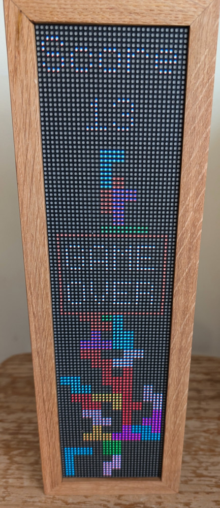

# DMD Games

## Introduction
The goal of this project is to create simple games or graphical effects for a DMD (Dot Display Matrix) 128x32.
### games:
- tetris
- snake
- Tic Tac Toe
- Invaders
### graphical effects:
- flames
- liquid
- snow
- cloud

The project is based on a  modification of the dmd-play.py program that you can found there:
https://github.com/batocera-linux/dmd-simulator

## Pre-Requisite
Before running the different programs you need to have a `dmdserver` running
https://github.com/PPUC/libdmdutil

It seems the `dmd-simulator` is very slow, the recommendation is to use a real DMD like **ZeDMD** https://github.com/PPUC/ZeDMD

**PixelCade** is also compatible with `dmdserver`, it should work.

## dmd-tetris

dmd-tetris is based on the following code: https://gist.github.com/timurbakibayev/1f683d34487362b0f36280989c80960c
Here is how to use the Gamepad:
- left/right: move your block
- down: accelerate the block fall
- A: rotate the block
- B: Drop the block
- left menu: restart the game
- right menu: pause
- X: if your are game over or in pause then exit the game

